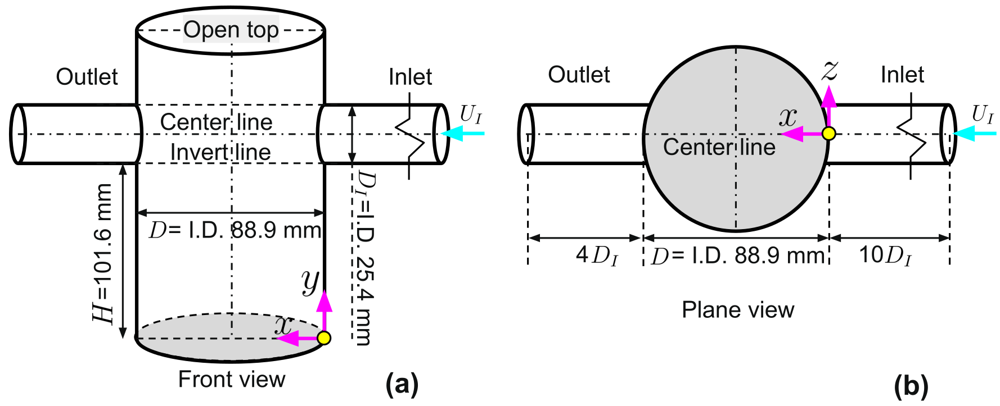

## Case 1 Bench-scale hydrodynamic separator
This repository contains the 2D planar PIV measurement of a bench-scale hydrodynamic separator.
- The statistics file is organized as $x$, $y$, $\left\langle u \right\rangle$, $\left\langle v \right\rangle$, $\left\langle u'u' \right\rangle$, $\left\langle v'v' \right\rangle$, $\left\langle u'v' \right\rangle$
- x and y are normalized by tank diameter $D$, and all the flow statistics are normalized by inlet bulk flow velocity $U_I$
### Geometry

### Visualization

